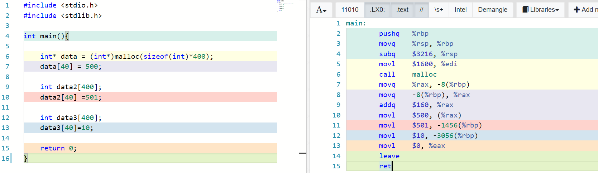

# Godbolt

I **strongly** recommend using the godbolt tool (https://godbolt.org/) to write and experiment with your C programs for this exercise (i.e. **You do not have to compile each example by hand using gcc if you'd like to use godbolt instead**).  The color mappings in Compiler explorer (i.e. Godbolt) will help you see what is going on with the generated assembly. You **can** try using both godbolt and your compiler to generate assembly for this exercise.

Here is an example of the Godbolt tool (and also shows part 4 of this lab)

# Task 1 - Compiler Generated Assembly

Let us get some experience reading assembly code generated by the compiler (or godbolt)! It is actually kind of fun, you may learn some new instructions, and at the very least gain some intuition for what code the compiler is generating.

## Compiler generated assembly 1 - Swap

- Write a C program that swaps two integers(in the main body of code).
  - Save, Compile, and Run the program to verify it works.
- Output the assembly from that program (Save it as swap_int.s).
  - Use: `gcc -O0 -fno-builtin swap_int.c -S -o swap_int.s`
- Now modify your program to swap two long's.
  - Save, Compile, and Run the program to verify it works.
- Output the assembly from that program (Save it as swap_long.s).
  - Use: `gcc -O0 -fno-builtin swap_long.c -S -o swap_long.s`
- Compare each of the two assembly files using diff. See what changed.
- diff syntax
  - Use: `diff -y swap_int.s swap_long.s`
  
### Response/Observations

1. Bytes allocated for long type in swap_long.s is doubled as bytes allocated for int type in swap_int.s. For example, int 1 is allocated 4 bytes and long 1 is allocated 8 bytes.
2. In swap_int.s, it uses %eax as register for int type, but in swap_long.s, it uses %rax as register for long type.

## Compiler generated assembly 2 - Functions

- Write a C program that swaps two integers in a **function** (You may use today's slide as a reference)
  - Save, Compile, and Run the program to verify it works.
- Output the assembly from that program (Save it as swap.s).
  - Use: `gcc -O0 -fno-builtin  swap.c -S -o swap.s`
- Do the instructions use memory/registers in a different way?

### Response/Observations

The two instructions use memory/registers in a different way.
In swap function, it uses indirect address but in main function, it uses direct address.
In swap function, parameters are stored as register mode but in main function, they are stored as immediate mode.

## Compiler generated assembly 3 - Static Array
- Write a C program called array.c that has an array of 400 integers in the function of main.
  - Initialize some of the values to something (do not use a loop) (e.g. myArray[0]=72; myArray[70]=56; etc)
  	- Note that it is helpful to use 'weird' numbers so you can see where they jump out.
  - Save, Compile, and Run the program to verify it works.
- Output the assembly from that program (Save it as array.s).
  - Use: `gcc -O0 -fno-builtin -mno-red-zone array.c -S -o array.s`
- How much are the offsets from the address?

### Response/Observations

        mov     DWORD PTR [rbp-1560], 121
        mov     DWORD PTR [rbp-1520], 484
        mov     DWORD PTR [rbp-1480], 878
        mov     DWORD PTR [rbp-80], 8888
        mov     DWORD PTR [rbp-8], 9999
        mov     DWORD PTR [rbp-4], 0
        
        So offsets = 1560 + 1520 + 1480 + 80 + 8 + 4 = 4652.
        Basically, the operating system assigns the base addresses. Element address = base address of the array + (offset number *number of bytes)
        Offset = Element address - base address of the array.
        
## Compiler generated assembly 4 - Dynamic Array 

- Write a C program called array2.c that has an array of 400 integers in the function of main that is dynamically allocated.
  - Initialize some of the values to something (do not use a loop) (e.g. myArray[66]=712; myArray[70]=536; etc)
  - Save, Compile, and Run the program to verify it works.
- Output the assembly from that program (Save it as array2.s).
  - Use: `gcc -O0 -fno-builtin  array2.c -S -o array2.s`
- Study the assembly and think about what is different from the static array.

### Response/Observations

Unlike static array which simply move the integer into the address, dynamic array allocate bytes for address and integer by "add" command, and then move the integer into the memory address.

## Compiler generated assembly 5 - Goto
The C programming language has a 'goto' command, search how to use it if you have not previously.
(Note that the usage of 'goto' is strongly discouraged in your programs--even mentionining such a keyword may anger programmers due to the difficulty of following many goto statements--that said, goto translates directly to an assembly command so it is interesting for this exercise)

- Write a C program using the goto command and a label.
  - Save, Compile, and Run the program to verify it works.
- Output the assembly from that program (Save it as goto.s).
  - Use: `gcc -O0 -fno-builtin  goto.c -S -o goto.s`
- Observe what kind of jmp statement is inserted.

### Response/Observations

jne     .L3     (Conditional)It jumps to the specified location if the Zero Flag (ZF) is cleared (0). Common after cmp.
jmp     .L4     It is an unconditional jump.
jle     .L4     (Conditional)It performs a signed comparison jump after a cmp if the destination operand is less than or equal to the source operand.

## Compiler generated assembly 6 - For-loops
- Write a C program using a for-loop that counts to 5.
  - Save, Compile, and Run the program to verify it works.
- Output the assembly from that program (Save it as for.s).
  - Use: `gcc -O0 -fno-builtin  for.c -S -o for.s`
- Observe where the code goes for the condition statement (at the start or at the end?).

### Response/Observations
At the start of the statement.
- cmp     DWORD PTR [rbp-4], 5
- jle     .L3

## Compiler generated assembly 7 - Switch Statements

- Write a C program using a switch statement (Sample here)[https://www.tutorialspoint.com/cprogramming/switch_statement_in_c.htm].
  - Save, Compile, and Run the program to verify it works.
- Output the assembly from that program (Save it as switch.s).
  - Use: `gcc -O0 -fno-builtin switch.c -S -o switch.s`
- See what code a switch statement generates. Is it optimal?

### Response/Observations

The switch statement generates many comparisons and conditional jump instructions. I don't think it is optimal.

## Compiler generated assembly 8 - Add Function

- Write a C program that calls an add function(long add(long a, long b).
  - Save, Compile, and Run the program to verify it works.
- Output the assembly from that program (Save it as add.s).
  - Use: `gcc -O0 -fno-builtin add.c -S -o add.s`
- Observe the outputs
- Observe arguments put into registers
- Observe where 'popq' is called.

### Response/Observations

After the return statement.
1. in function add(), aftern return;
2. In main(), after return.

# More resources to help

- Matt Godbolt has written a great tool to help understand assembly generated from the compiler. 
  - https://godbolt.org/
- An assembly cheat sheet from Brown
  - https://cs.brown.edu/courses/cs033/docs/guides/x64_cheatsheet.pdf
- MIT Cheat sheet
  - http://6.035.scripts.mit.edu/sp17/x86-64-architecture-guide.html

# Deliverable

1. Add your .S files that you have generated to this repository (whether from gcc or from godbolt.org / CompilerExplorer ).
  - Note this submission will be auto graded for completion (i.e. save the file names as shown).
  - Add your observations (brief 1-2 sentences) in the appropriate response/observations section for each code in this readme file.
  

# Going Further

- (Optional) Try the objdump example to read the disassembly from your programs executables. Observe how close the output is to the compiler generated output.
